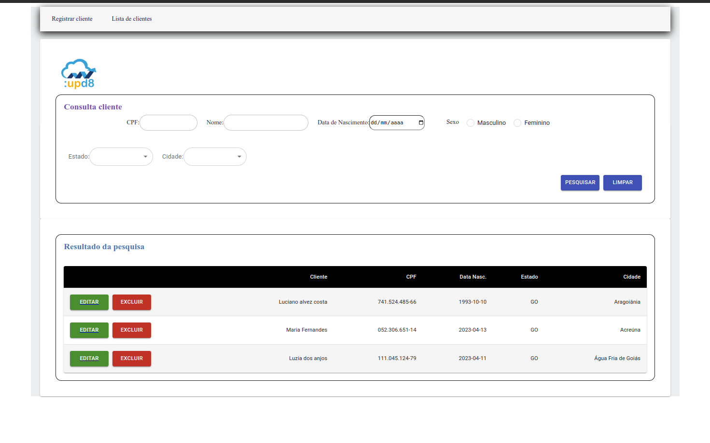
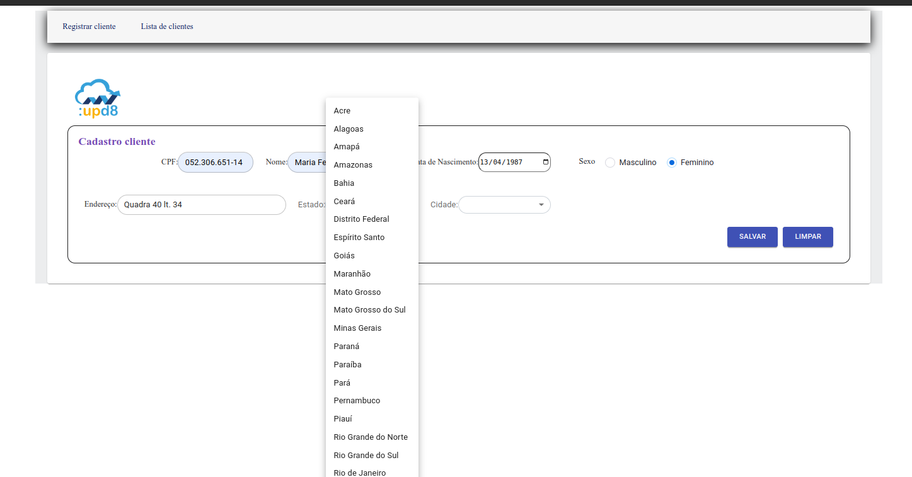
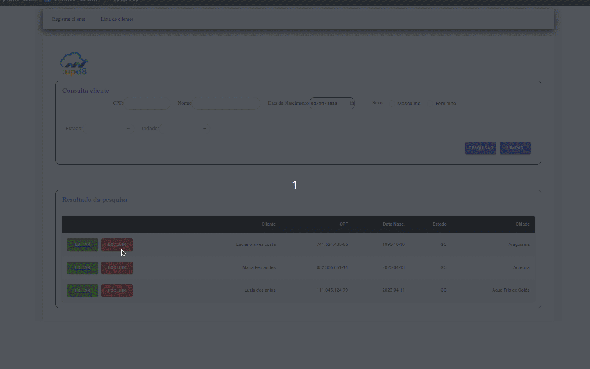
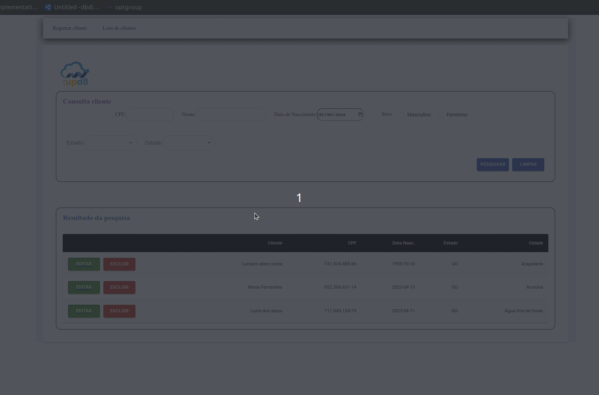

# Projeto de teste prático para a empresa | :upd8

Este projeto foi desenvolvido usando [Create React App](https://github.com/facebook/create-react-app).

### `UM pouco sobre a implementação:`

O objetivo do projeto era criar um micro sistema onde temos a funcionalidade para listar adicionar excluir e editar clientes na plataforma, foi usado alguns recursos de gerenciamento de estado como por exemplo o redux, que traz um acoplamento global para a aplicação, deixando os recursos de forma externalizada

## Instalação para primeira vez de uso.
Instalar as dependências
> `yarn install` ou `npm install`
## Inicie a aplicação com o comando 

>`yarn start`

* Aqui está algumas fotos das telas

>`Tela de listagem dos clientes`

* Aqui está a tela para realizar o cadastro

>`Cadastrando cliente`

* Na tela de listar, quando desejar excluir um cliente ele te pergunta se quer fazer isso mesmo

>`Deseja excluir um cliente?`

* O sistema permite fazer busca por multiplos campos também, na parte superior da tela é só escolher qual cliente quer buscar adicionando os dados.

>`Deseja excluir um cliente?`

## Por enquanto é isso, vlw!

> :)
